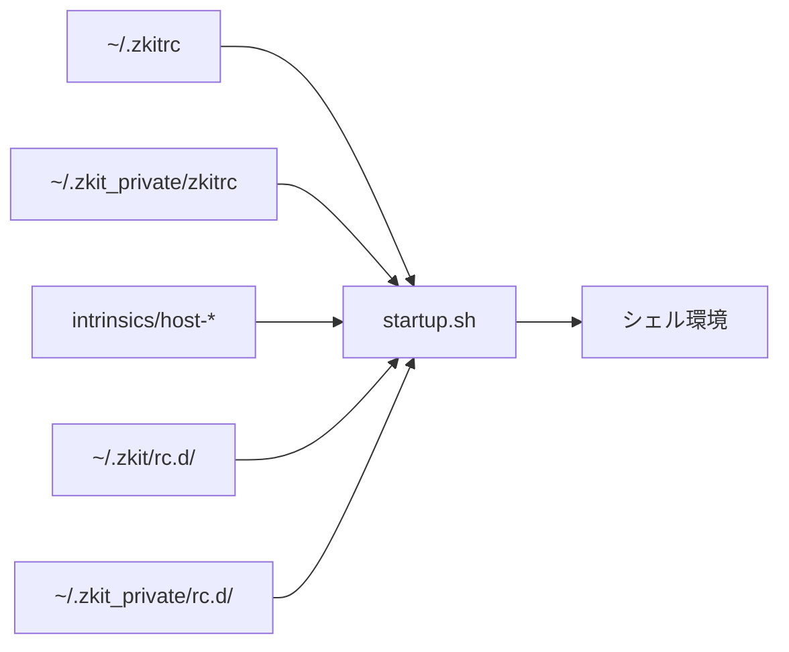

# カスタマイズ方法

zkit のカスタマイズは、**レイヤーごとに役割が分かれている**のが特徴です。変更したい内容に応じて、適切な場所に設定を追加してください。

## カスタマイズのレイヤー



| レイヤー | 場所 | 用途 | git 管理 |
|---|---|---|---|
| 個人設定 | `~/.zkitrc` | 環境変数、ZKIT_SETUPS など | 任意（通常はローカルのみ） |
| プライベート設定 | `~/.zkit_private/zkitrc` | 機密を含む個人設定 | private repo |
| ホスト固有 | `~/.zkit_private/intrinsics/host-*` | マシンごとの PATH 等 | private repo |
| 公開 rc | `~/.zkit/rc.d/` | 共通の環境設定 | zkit repo |
| プライベート rc | `~/.zkit_private/rc.d/` | 個人・機密の環境設定 | private repo |
| セットアップ | `setup.d/` / `~/.zkit_private/setup.d/` | dotfile 配置・初回設定 | 各 repo |

**原則**: 公開 repo（`~/.zkit`）には汎用的な設定を、private repo（`~/.zkit_private`）には個人・機密の設定を置きます。

## ~/.zkitrc

`startup.sh` の冒頭で読み込まれます。zkit 本体を fork せずに個人設定を加えたい場合に使います。

```zsh
# ~/.zkitrc の例

# デバッグ出力を有効化
ZKIT_DEBUG=true

# umask を変更
zkit_umask=0022

# zkit_setup で実行する setup スクリプトを追加
ZKIT_SETUPS_LOCAL=( emacs python git )

# プライベート repo の clone URL（初回セットアップ時）
ZKIT_PRIVATE_REPO=git@github.com:you/zkit_private.git

# 自動更新を無効化
ZKIT_AUTOUPDATE=false
```

### 主な設定変数

| 変数 | 説明 |
|---|---|
| `ZKIT_SETUPS` | `zkit_setup` が実行する setup.d スクリプト名の配列（デフォルト: `bash zsh`） |
| `ZKIT_SETUPS_LOCAL` | 上記に追加する setup 名（`~/.zkitrc` 向け） |
| `ZKIT_PRIVATE_REPO` | private repo の git URL |
| `ZKIT_AUTOUPDATE` | `zkit_setup` 時の git pull（デフォルト: `true`） |
| `ZKIT_DEBUG` | rc 読み込みメッセージの表示（デフォルト: `false`） |
| `zkit_umask` | umask 値（デフォルト: `0077`） |

## ~/.zkit_private/

プライベート設定用ディレクトリです。git repo として管理するのが想定されています。

### zkitrc

`~/.zkitrc` と同様の設定を記述します。`startup.sh` では `~/.zkitrc` の直後に読み込まれます。

### rc.d/

zkit 本体の `rc.d/` と同じ形式でスクリプトを置けます。ファイル名の辞書順で、本体 rc.d の **後** に読み込まれます。

```zsh
# ~/.zkit_private/rc.d/50-my-tools.zsh の例

pathmunge ~/tools/bin
alias mycmd='~/tools/mycmd'
```

**ファイル拡張子**:

- `.sh` — zsh / bash 共通（両方で読み込まれる）
- `.zsh` — zsh のみ
- `.bash` — bash のみ

番号帯は本体 rc.d と同じ規則に従います（[rc.d リファレンス](./rc.d.md)）。

### intrinsics/

ホスト固有の **初期変数** を定義します。rc.d より先に読み込まれるため、後続スクリプトで参照する変数をここに置きます。

```
~/.zkit_private/intrinsics/
├── host-my-mac.local    # FQDN 完全一致
└── host-my-mac          # ホスト名の第1ラベル（フォールバック）
```

```zsh
# host-my-mac の例
__zkit_path+=( /opt/custom/bin )
export MY_API_KEY=...
```

`__zkit_path` は `00-common.sh` で定義される PATH 追加候補の配列です。intrinsic で要素を追加すると、`01-initialize.*` の PATH 構築時に反映されます。

### setup.d/

`zkit_setup` 実行時に走るスクリプトです。private 側に同名ファイルがあると、本体より **後** に実行されます。

```
# 本体のみ実行
ZKIT_SETUPS=( git )

# 本体を実行したうえで private も実行
ZKIT_SETUPS=( +git )

# private のみ（本体が存在しなくても OK なら private 側だけ置く）
ZKIT_SETUPS=( mysetup )
```

先頭に `+` を付けると、本体と private の **両方** を実行します（private のみがデフォルト）。

## rc.d スクリプトの追加・変更

### 新しい設定を追加する

1. **汎用的な設定** → `~/.zkit/rc.d/` に PR / commit
2. **個人・機密の設定** → `~/.zkit_private/rc.d/` に追加

ファイル名は `{番号2桁}-{説明}.{sh|zsh|bash}` 形式にします。

```
40-my-lang.sh      # 言語系（30-39 帯の次）
85-my-completion.zsh # 対話機能系
```

### 既存設定を無効化する

rc.d には無効化機構はありません。以下のいずれかで対応します。

- ファイルをリネームして番号帯外にする（例: `30-python.sh` → `_30-python.sh.disabled`）
- private rc.d で上書き・打ち消し（PATH から削除、unalias など）
- zkit repo 側でファイルを削除

### シェル固有の設定

zsh 専用の設定は `.zsh`、bash 専用は `.bash`、両対応は `.sh` にします。

```zsh
# 80-interactive.zsh — zsh 対話設定の例
if [[ -n $PS1 ]]; then
    bindkey -e
    # ...
fi
```

## ホスト別 rc（90-private.sh）

`90-private.sh` は rc.d 読み込みの末尾付近で、ホスト名に基づく追加 rc を source します。

```
~/.zkit_private/rc.d/
├── host-my-mac.local.zsh
└── host-my-mac.zsh       # フォールバック
```

intrinsic（変数定義）と host rc（追加設定・alias など）を使い分けると整理しやすくなります。

## zstyle による zkit 内部設定

zsh では `01-initialize.zsh` で以下の zstyle が設定されます。

```zsh
zstyle ':zkit:*' rprompt off
zstyle ':zkit:*' compinit_secure off
zstyle ':zkit:*' vcs_info off
```

`~/.zkitrc` や private rc.d で上書きできます。

```zsh
zstyle ':zkit:*' vcs_info on
```

## テンプレートと dotfile 配置

### __zkit_install

zkit 内のファイルをホームディレクトリにコピーします。既存ファイルと内容が同じ場合はスキップ、異なる場合は `.bak` バックアップを取ってから上書きします。

```zsh
__zkit_install zsh/.zshenv ${HOME}/.zshenv
```

### __zkit_template

テンプレート変数（`$USER`, `$EMAIL` など）を展開してファイルを生成します。

```zsh
__zkit_template templates/gitconfig.tmpl ${HOME}/.gitconfig 600
```

テンプレートは `~/.zkit/templates/` に置きます。setup.d スクリプトから呼び出すのが一般的です。

## よくあるカスタマイズ例

### PATH にディレクトリを追加

```zsh
# ~/.zkit_private/rc.d/05-path.zsh
pathmunge ~/go/bin
pathmunge ~/.cargo/bin after   # 末尾に追加
export PATH
```

`pathmunge` は zsh 関数として autoload されています。

### プロンプトの変更

`81-prompt.zsh` を参考に、private rc.d で `PS1` / `PROMPT` / `RPROMPT` を再定義します。番号を `82-` 以降にすると、本体プロンプト設定の後に読み込まれます。

```zsh
# ~/.zkit_private/rc.d/82-my-prompt.zsh
if [[ -n $PS1 ]]; then
    PROMPT='%F{green}%n@%m%f:%~$ '
fi
```

### 言語環境（Python, Node など）の追加

本体の `30-python.sh`, `34-nvm.sh` などを参考に、同じ番号帯で private rc.d に追加します。不要なものは本体側ファイルを無効化してください。

### 新しい setup スクリプトの追加

```bash
# ~/.zkit_private/setup.d/myapp.sh
__zkit_template templates/myapp.conf.tmpl ${HOME}/.config/myapp/conf
```

`~/.zkitrc` に追加:

```zsh
ZKIT_SETUPS_LOCAL=( myapp )
```

## カスタマイズのベストプラクティス

1. **機密情報は private repo へ** — API キー、社内パス、個人メール設定など
2. **番号帯を守る** — 読み込み順序が崩れないよう、適切な番号を選ぶ
3. **対話専用は `PS1` チェック** — スクリプト実行時の副作用を避ける
4. **`.sh` と `.zsh` を混同しない** — bash でも必要なら `.sh` を使う
5. **変更後は新しいシェルで確認** — `ZKIT_DEBUG=true zsh -l` が便利

## トラブルシューティング

| 症状 | 確認ポイント |
|---|---|
| 設定が反映されない | ファイル名の拡張子（`.zsh` vs `.bash`）、読み取り権限 |
| 読み込み順序がおかしい | ファイル名の番号・辞書順を確認 |
| エラーで起動が止まる | 問題の rc ファイルを特定（`ZKIT_DEBUG=true`） |
| `~/.zshrc` を編集しても変わらない | 実際の設定は `$ZKIT/zsh/.zshrc`（`ZDOTDIR` 配下） |
| private 設定が効かない | `~/.zkit_private/` の存在、`zkitrc` の内容 |
