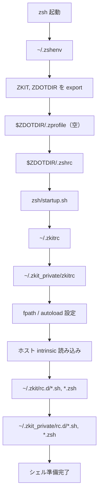

# 起動フロー

zkit の zsh 起動フローを、シェルが実際に読むファイルの順序に沿って説明します。

## zsh の起動ファイルと読み込み条件

zsh は起動モード（ログイン / 対話 / バッチ）によって読むファイルが異なります。

| 順序 | ファイル | ログイン | 対話 | バッチ |
|---|---|---|---|---|
| 1 | `~/.zshenv` | ○ | ○ | ○ |
| 2 | `~/.zprofile` | ○ | | |
| 3 | `~/.zshrc` | | ○ | |
| 4 | `~/.zlogin` | ○ | | |

zkit では **1 と 3** が中心です（`.zprofile` は空ファイル）。

## 全体フロー（図）



## ステップ詳細

### 1. `~/.zshenv`（常に最初）

`bin/zkit_setup` → `setup.d/zsh.sh` により、`~/.zshenv` に配置されます。内容は `zsh/.zshenv` と同一です。

```zsh
setopt No_GLOBAL_RCS    # /etc/zsh* を読み込まない
export ZKIT=${ZKIT=${HOME}/.zkit}
export ZDOTDIR=${ZKIT}/zsh
```

ここで行われること:

- **`No_GLOBAL_RCS`**: システム全体の `/etc/zsh*` を読み込まない
- **`ZKIT`**: zkit 本体のパス（既に設定されていればそれを尊重）
- **`ZDOTDIR`**: 以降の zsh 起動ファイル（`.zprofile`, `.zshrc` など）の読み込み先を `$ZKIT/zsh` に切り替え

> **注意**: `.zshenv` だけは `$HOME` 直下から読まれます。`ZDOTDIR` の影響を受けません。

### 2. `$ZDOTDIR/.zprofile`

現在は空ファイルです。ログインシェル専用の処理を追加する場合はここに記述します。

### 3. `$ZDOTDIR/.zshrc`

```zsh
source ${ZDOTDIR}/startup.sh
```

すべての rc 読み込みは `startup.sh` に委譲されます。

### 4. `zsh/startup.sh`（コアロジック）

#### 4-1. 作業ディレクトリの確保

```zsh
mkdir -p "${ZKIT}/var/tmp"
mkdir -p "${ZKIT}/var/cache"
mkdir -p "${ZKIT}/var/log"
```

#### 4-2. ユーザー設定の読み込み

| 順序 | ファイル | 用途 |
|---|---|---|
| 1 | `~/.zkitrc` | 個人設定（環境変数、ZKIT_SETUPS など） |
| 2 | `~/.zkit_private/zkitrc` | プライベート repo 側の設定 |

#### 4-3. ユーティリティ関数のロード

```zsh
fpath=( ${ZDOTDIR}/functions $fpath )
autoload -Uz array_pack pathmunge envpathmunge zkit_utils
zkit_utils   # __zkit_msg, __zkit_have などを autoload
```

`zkit_utils` を呼ぶと、以下の関数が autoload されます。

- `__zkit_msg` / `__zkit_err` / `__zkit_die` — ログ出力
- `__zkit_have` — コマンド存在確認
- `__zkit_run` — コマンド実行
- `__zkit_install` / `__zkit_template` — ファイル配置

#### 4-4. umask

```zsh
umask ${zkit_umask:=0077}
```

`zkit_umask` は `~/.zkitrc` や intrinsic で上書き可能です。

#### 4-5. ホスト固有 intrinsic

`~/.zkit_private/intrinsics/` から、ホスト名に一致するファイルを探して source します。

```
host-$(hostname)        # 例: host-my-mac.local
  ↓ 見つからなければ
host-$(hostname の第1ラベル)  # 例: host-my-mac
```

ここで PATH の追加やホスト固有の環境変数を定義します。

#### 4-6. rc.d スクリプトの読み込み

```zsh
__zkit_load_rc ${ZKIT}/rc.d/*.sh(N) ${ZKIT}/rc.d/*.zsh(N)
__zkit_load_rc ${ZKIT_PRIVATE}/rc.d/*.sh(N) ${ZKIT_PRIVATE}/rc.d/*.zsh(N)
```

`__zkit_load_rc` の動作:

1. ファイル名（basename）で **辞書順ソート**
2. 読み取り可能なファイルのみ `source`
3. 対話シェル（`PS1` が設定済み）または `ZKIT_DEBUG=true` のとき、`__zkit_msg "load: ..."` を表示
4. 非対話シェルでは出力を `/dev/null` に抑制

## rc.d の読み込み順序（例）

ファイル名の先頭数字で制御されます。同じ番号帯内ではファイル名の辞書順です。

```
00-common.sh
01-initialize.zsh
03-environment.sh
21-svn.sh
22-git.zsh
30-python.sh
...
80-interactive.zsh
81-00-prompt-color.zsh
81-prompt.zsh
...
90-private.sh
99-housekeep.zsh
99-macro-check.sh
```

番号帯の意味は [rc.d リファレンス](./rc.d.md) を参照してください。

## 対話シェルと非対話シェルの違い

| 条件 | 動作 |
|---|---|
| 対話シェル（`PS1` あり） | rc.d の読み込みメッセージを表示。`80-interactive.zsh` など対話専用設定が有効 |
| 非対話シェル（スクリプト実行など） | rc 出力を抑制。対話専用ブロック（`if [[ -n $PS1 ]]`）はスキップ |
| `ZKIT_DEBUG=true` | 非対話でも読み込みメッセージを表示 |

## bash の起動フロー（参考）

bash では zkit が以下の dotfile を `setup.d/bash.sh` 経由で配置します。

```
~/.bash_profile  →  startup.sh を source（ログインシェル）
~/.bashrc        →  startup.sh を source（対話シェル）
```

`bash/startup.sh` は zsh 版と同様に rc.d を読み込みますが、対象は `*.sh` と `*.bash` です。

## zkit_setup との関係

`zkit_setup` は **シェル起動時には実行されません**。初回インストールや手動メンテナンス時に実行するセットアップツールです。

```
zkit_setup
  ├── ~/.zkitrc / zkitrc 読み込み
  ├── git pull（ZKIT, ZKIT_PRIVATE）
  ├── intrinsics 適用
  └── setup.d/* 実行
        ├── bash.sh   → ~/.bashrc 等を配置
        ├── zsh.sh    → ~/.zshenv を配置
        ├── git.sh    → ~/.gitconfig を生成
        └── ...
```

日常のシェル起動は `~/.zshenv` → `startup.sh` → `rc.d/` の流れのみです。

## デバッグ方法

起動時に何が読み込まれているか確認するには:

```zsh
ZKIT_DEBUG=true zsh -l
```

または `~/.zkitrc` に以下を追加:

```zsh
ZKIT_DEBUG=true
```

緑色（xterm 系）またはプレーンなテキストで `load: /path/to/rc.d/...` が表示されます。
